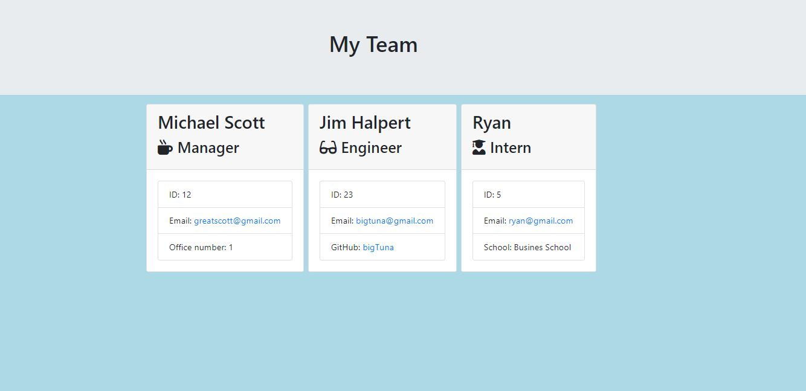

  # Team Dash Board 

  
  ## Description
  The Team Dash Board Generator is a command-line-input application run in Node that uses Inquirer to prompt the user for information regarding their team memebers. The generator will take the data and create a dashboard with Bootstrap styling and active links to Github accounts and emails.  

  

  [Project Link](https://github.com/Jason-Jorgensen/TeamDashboard)

  ## Table of Contents

  * [Installation](#installation)
  * [Usage](#usage)
  * [License](#license)
  * [Contributing](#contributing)
  * [Tests](#tests)
  * [Questions](#questions)

  ## Installation

  npm i

  ## Usage

  Use node index.js to start the command line program.

  ## License

  This project is licensed under the MIT license.

  ## Techniques and Technologies Used

  This application was developed using Object-Oriented Programming. Classes and constructors were used to produce team member objects and the program runs using Node.js, inquirer, and FS node module. The app was made by using test-driven development. 
  

  ## Tests

  To run tests, run the following command: 

  npm test

  ## Questions
  If you have any questions please email me at jasoncjorgensen@gmail.com.

  Also, please see my [GitHub](https://github.com/Jason-Jorgensen)
